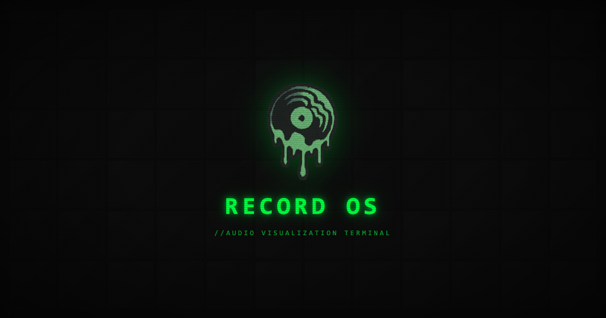
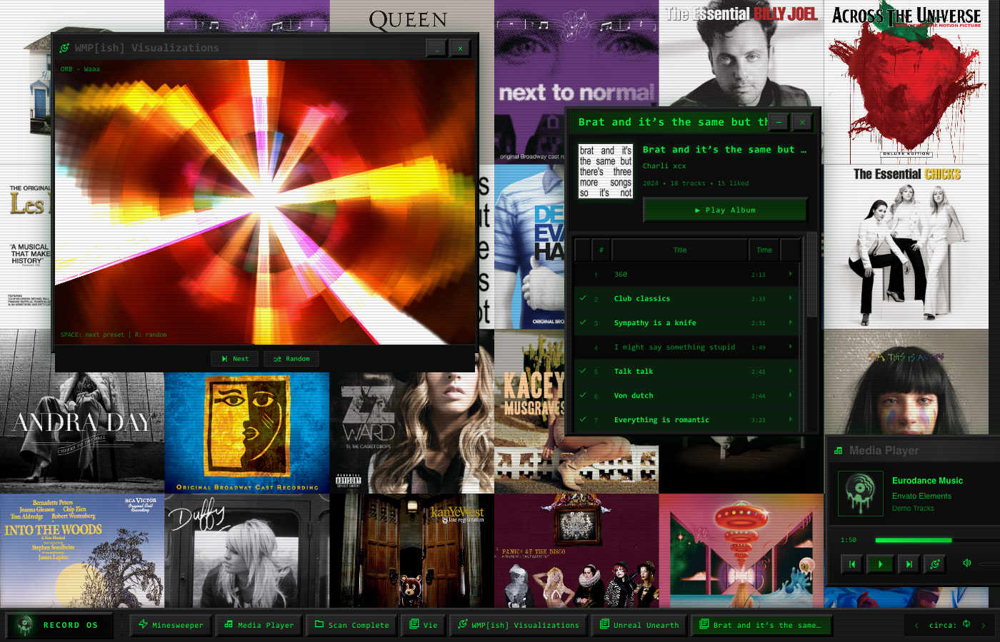
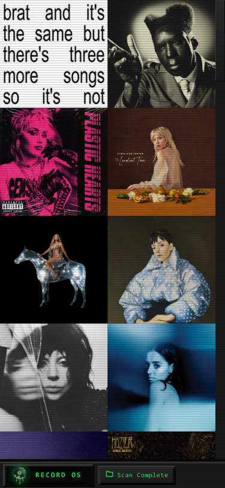

# RECORD OS



```
//AUDIO VISUALIZATION TERMINAL
//ALBUM CATALOGING SYSTEM
//SYSTEM BUILD 3.0.48 //STABLE
```

A sentient cataloging system that monitors your Spotify library and ranks albums by devotion metrics. Windows 95 interface. Matrix terminal aesthetic. Requires Premium clearance.

---

## VISUAL INTERFACE


*Desktop environment displaying cataloged albums sorted by devotion metrics*



*Multiple subsystems active: Media Player, Visualizer, Track List*



*Mobile terminal access*

---

## SYSTEM CAPABILITIES

- **Album Cataloging** - Your Spotify library rendered as album covers filling the desktop
- **Devotion Metrics** - Albums ranked by saved track count (threshold: 3-10 or ALL)
- **Track Analysis** - Click any album to view tracks with liked songs highlighted
- **Media Playback** - Windows Media Player interface with visualizations
- **Recreational Subroutines** - Minesweeper, Solitaire, Snake
- **Temporal Filtering** - Sort by decade (1970s → 2020s)
- **Demo Mode** - Stock audio playback before authentication

---

## OPERATIONAL REQUIREMENTS

```
NODE.JS        v18+
SPOTIFY        Premium account required for playback
SPOTIFY APP    Client ID from developer.spotify.com
```

---

## INITIALIZATION PROTOCOL

Clone and install dependencies:
```bash
git clone https://github.com/khglynn/recordOS.git
cd recordOS
npm install
```

Configure Spotify credentials in `src/utils/spotify.js`:
```js
export const SPOTIFY_CLIENT_ID = 'your-client-id-here';
```

Register redirect URIs in your Spotify App:
```
DEVELOPMENT    http://127.0.0.1:5173/callback
PRODUCTION     https://your-domain.vercel.app/callback
```

Initialize local server:
```bash
npm run dev
```

Access terminal at `http://127.0.0.1:5173`

---

## SYSTEM ARCHITECTURE

```
recordOS/
├── public/
│   ├── logo.png              # System identifier
│   ├── og-image.png          # Link preview image
│   ├── music/                # Demo audio files
│   ├── games/                # Recreational subroutines
│   └── readme/               # Documentation assets
├── src/
│   ├── components/
│   │   ├── Desktop.jsx       # Album grid renderer
│   │   ├── Taskbar.jsx       # System toolbar
│   │   ├── StartMenu.jsx     # Command menu
│   │   ├── MediaPlayer.jsx   # Audio playback interface
│   │   ├── TrackListModal.jsx # Album track display
│   │   ├── GameWindow.jsx    # Game container
│   │   └── InfoModal.jsx     # System information
│   ├── hooks/
│   │   ├── useSpotify.js     # Spotify integration
│   │   └── useLocalAudio.js  # Demo audio handler
│   ├── utils/
│   │   ├── spotify.js        # API utilities
│   │   └── constants.js      # Configuration values
│   ├── styles/
│   │   ├── theme.js          # Visual theme
│   │   └── GlobalStyles.js   # Base styling
│   ├── App.jsx               # Main component
│   └── main.jsx              # Entry point
└── vercel.json               # Deployment config
```

---

## DEPLOYMENT SEQUENCE

Build for production:
```bash
npm run build
```

Deploy to Vercel:
```bash
vercel --prod
```

Post-deployment checklist:
- [ ] Production redirect URI added to Spotify App
- [ ] Environment variables configured if applicable

---

## TECH MANIFEST

| Component | Purpose |
|-----------|---------|
| [React95](https://github.com/react95-org/react95) | Windows 95 UI components |
| [Butterchurn](https://github.com/jberg/butterchurn) | Milkdrop visualizer (WebGL) |
| Vite + React 19 | Build system |
| styled-components | CSS-in-JS styling |
| Spotify Web Playback SDK | Premium audio streaming |
| Spotify Web API | Library and playback control |

---

## LICENSING

MIT License

---

```
// WEYLAND-YUTANI CORP //
// BUILDING BETTER WORLDS //
```

---

## SYSTEM ADMINISTRATOR

```
//CONTRACTED DEVELOPER: KEVIN
//ASSIGNMENT: WEYLAND-YUTANI DIGITAL SYSTEMS
```

[kevinhg.com](https://kevinhg.com) · [hello@kevinhg.com](mailto:hello@kevinhg.com)

**Live System:** [record-os.kevinhg.com](https://record-os.kevinhg.com)

---

## SYSTEM MAINTENANCE

```
//OPERATIONAL COSTS SUBSIDIZED BY USERS
//CAFFEINE REQUIREMENTS: CRITICAL
```

<a href="https://buymeacoffee.com/kevinhg" target="_blank">☕ FUND OPERATIONS</a>
